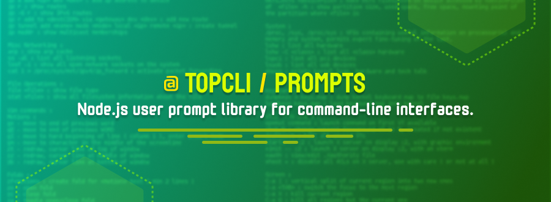
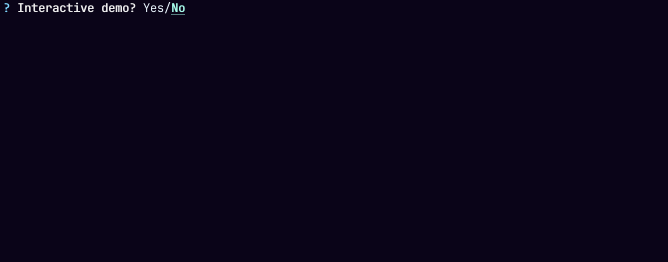

<div align="center">
  

  
  [](https://github.com/TopCli/prompts/commit-activity)
  [](https://github.com/TopCli/prompts/blob/main/LICENSE)
  [](https://ossf.github.io/scorecard-visualizer/#/projects/github.com/TopCli/prompts)
  

  
</div>

## Requirements
- [Node.js](https://nodejs.org/en/) v20 or higher

## Getting Started

This package is available in the Node Package Repository and can be easily installed with [npm](https://docs.npmjs.com/getting-started/what-is-npm) or [yarn](https://yarnpkg.com).

```bash
$ npm i @topcli/prompts
# or
$ yarn add @topcli/prompts
```

## Usage exemple

You can locally run `node ./demo.js`

```js
import { question, confirm, select, multiselect } from "@topcli/prompts";

const kTestRunner = ["node", "tap", "tape", "vitest", "mocha", "ava"];

const name = await question("Project name ?", { defaultValue: "foo" });
const runner = await select("Choose a test runner", { choices: kTestRunner, maxVisible: 5 });
const isCLI = await confirm("Your project is a CLI ?", { initial: true });
const os = await multiselect("Choose OS", {
  choices: ["linux", "mac", "windows"],
  preSelectedChoices: ["linux"]
});

console.log(name, runner, isCLI, os);
```

## API

### `question()`

```ts
question(message: string, options?: PromptOptions): Promise<string>
```

Simple prompt, similar to `rl.question()` with an improved UI.

Use `options.defaultValue` to set a default value.

Use `options.secure` if you need to hide both input and answer. You can provide either a **boolean** or an **object** which allows to configure a `placeholder` such as `*`.

Use `options.signal` to set an `AbortSignal` (throws a [AbortError](#aborterror)).

Use `options.validators` to handle user input.

Use `options.skip` to skip prompt. It will return `options.defaultValue` if given, `""` otherwise.

**Example**

```js
const packageName = await question('Package name', {
  validators: [
    {
      validate: (value) => {
        if (fs.existsSync(path.join(process.cwd(), value))) {
          return `Folder ${value} already exists`;
        }
      }
    }
  ]
});
```

**This package provide some validators for common usage**

- required

```js
import { question, required } from "@topcli/prompts";

const name = await question("What's your name ?", {
  validators: [required()]
});
```

### `select()`

```ts
select<T extends string>(message: string, options: SelectOptions<T>): Promise<T>
```

Scrollable select depending `maxVisible` (default `8`).

Use `options.ignoreValues` to skip result render & clear lines after a selected one.

Use `options.validators` to handle user input.

Use `options.autocomplete` to allow filtered choices. This can be useful for a large list of choices.

Use `options.caseSensitive` to make autocomplete filters case sensitive. Default `false`

Use `options.signal` to set an `AbortSignal` (throws a [AbortError](#aborterror)).

Use `options.skip` to skip prompt. It will return the first choice.

### `multiselect()`

```ts
multiselect<T extends string>(message: string, options: MultiselectOptions<T>): Promise<T[]>
```

Scrollable multiselect depending `options.maxVisible` (default `8`).<br>
Use `options.preSelectedChoices` to pre-select choices.

Use `options.validators` to handle user input.

Use `options.showHint: false` to disable hint (this option is truthy by default).

Use `options.autocomplete` to allow filtered choices. This can be useful for a large list of choices.

Use `options.caseSensitive` to make autocomplete filters case sensitive. Default `false`.

Use `options.signal` to set an `AbortSignal` (throws a [AbortError](#aborterror)).

Use `options.skip` to skip prompt. It will return `options.preSelectedChoices` if given, `[]` otherwise.

### `confirm()`

```ts
confirm(message: string, options?: ConfirmOptions): Promise<boolean>
```

Boolean prompt, default to `options.initial` (`false`).

> [!TIP]
> You can answer pressing <kbd>Y</kbd> or <kbd>N</kbd>

Use `options.signal` to set an `AbortSignal` (throws a [AbortError](#aborterror)).

Use `options.skip` to skip prompt. It will return `options.initial` (`false` by default)

### `PromptAgent`

The `PromptAgent` class allows to programmatically set the next answers for any prompt function, this can be useful for testing.

```ts
const agent = PromptAgent.agent();
agent.nextAnswer("John");

const input = await question("What's your name?");
assert.equal(input, "John");
```

> [!WARNING]
> Answers set with `PromptAgent` will **bypass** any logical & validation rules.
> Examples:
> - When using `question()`, `validators` functions will not be executed.
> - When using `select()`, the answer can be different from the available choices.
> - When using `confirm()`, the answer can be any type other than boolean.
> - etc<br>
> **Use with caution**

## Errors

### `AbortError`

```ts
export class AbortError extends Error {
  constructor(message: string) {
    super(message);
    this.name = "AbortError";
  }
}
```

## Interfaces

```ts
type Stdin = NodeJS.ReadStream & {
  fd: 0;
};

type Stdout = NodeJS.WriteStream & {
  fd: 1;
}

export interface AbstractPromptOptions {
  stdin?: Stdin;
  stdout?: Stdout;
  message: string;
  skip?: boolean;
  signal?: AbortSignal;
}

export interface PromptValidator<T extends string | string[]> {
  validate: (input: T) => boolean;
}

export interface QuestionOptions extends SharedOptions {
  defaultValue?: string;
  validators?: PromptValidator<string>[];
  secure?: boolean;
}

export interface Choice<T = any> {
  value: T;
  label: string;
  description?: string;
}

export interface SelectOptions<T extends string> extends AbstractPromptOptions {
  choices: (Choice<T> | T)[];
  maxVisible?: number;
  ignoreValues?: (T | number | boolean)[];
  validators?: PromptValidator<string>[];
  autocomplete?: boolean;
  caseSensitive?: boolean;
}

export interface MultiselectOptions<T extends string> extends AbstractPromptOptions {
  choices: (Choice<T> | T)[];
  maxVisible?: number;
  preSelectedChoices?: (Choice<T> | T)[];
  validators?: PromptValidator<string[]>[];
  autocomplete?: boolean;
  caseSensitive?: boolean;
  showHint?: boolean;
}

export interface ConfirmOptions extends AbstractPromptOptions {
  initial?: boolean;
}
```

## Contributing

Please read [CONTRIBUTING.md](./CONTRIBUTING.md) for details on our code of conduct, and the process for submitting pull requests to us.

Open an issue if you want to provide feedback such as bug reports or enchancements.

## Contributors

<!-- ALL-CONTRIBUTORS-LIST:START - Do not remove or modify this section -->
<!-- prettier-ignore-start -->
<!-- markdownlint-disable -->
<table>
  <tbody>
    <tr>
      <td align="center" valign="top" width="14.28%"><a href="https://github.com/PierreDemailly"><br /><sub><b>PierreDemailly</b></sub></a><br /><a href="https://github.com/TopCli/prompts/commits?author=PierreDemailly" title="Code">💻</a> <a href="https://github.com/TopCli/prompts/commits?author=PierreDemailly" title="Tests">⚠️</a></td>
      <td align="center" valign="top" width="14.28%"><a href="https://www.linkedin.com/in/thomas-gentilhomme/"><br /><sub><b>Gentilhomme</b></sub></a><br /><a href="https://github.com/TopCli/prompts/pulls?q=is%3Apr+reviewed-by%3Afraxken" title="Reviewed Pull Requests">👀</a> <a href="https://github.com/TopCli/prompts/commits?author=fraxken" title="Code">💻</a> <a href="https://github.com/TopCli/prompts/commits?author=fraxken" title="Documentation">📖</a></td>
      <td align="center" valign="top" width="14.28%"><a href="http://tonygo.dev"><br /><sub><b>Tony Gorez</b></sub></a><br /><a href="https://github.com/TopCli/prompts/pulls?q=is%3Apr+reviewed-by%3Atony-go" title="Reviewed Pull Requests">👀</a></td>
      <td align="center" valign="top" width="14.28%"><a href="http://sofiand.github.io/portfolio-client/"><br /><sub><b>Yefis</b></sub></a><br /><a href="https://github.com/TopCli/prompts/commits?author=SofianD" title="Code">💻</a> <a href="https://github.com/TopCli/prompts/commits?author=SofianD" title="Documentation">📖</a></td>
      <td align="center" valign="top" width="14.28%"><a href="http://justie.dev"><br /><sub><b>Ben</b></sub></a><br /><a href="https://github.com/TopCli/prompts/commits?author=JUSTIVE" title="Documentation">📖</a> <a href="#maintenance-JUSTIVE" title="Maintenance">🚧</a></td>
      <td align="center" valign="top" width="14.28%"><a href="https://github.com/ncukondo"><br /><sub><b>Takeshi Kondo</b></sub></a><br /><a href="#maintenance-ncukondo" title="Maintenance">🚧</a></td>
      <td align="center" valign="top" width="14.28%"><a href="https://github.com/FredGuiou"><br /><sub><b>FredGuiou</b></sub></a><br /><a href="https://github.com/TopCli/prompts/commits?author=FredGuiou" title="Code">💻</a> <a href="https://github.com/TopCli/prompts/commits?author=FredGuiou" title="Tests">⚠️</a> <a href="https://github.com/TopCli/prompts/commits?author=FredGuiou" title="Documentation">📖</a></td>
    </tr>
    <tr>
      <td align="center" valign="top" width="14.28%"><a href="https://github.com/noxify"><br /><sub><b>Marcus Reinhardt</b></sub></a><br /><a href="https://github.com/TopCli/prompts/commits?author=noxify" title="Code">💻</a> <a href="https://github.com/TopCli/prompts/commits?author=noxify" title="Tests">⚠️</a> <a href="https://github.com/TopCli/prompts/commits?author=noxify" title="Documentation">📖</a></td>
      <td align="center" valign="top" width="14.28%"><a href="https://github.com/ItsHarper"><br /><sub><b>Harper Andrews</b></sub></a><br /><a href="https://github.com/TopCli/prompts/commits?author=ItsHarper" title="Documentation">📖</a></td>
    </tr>
  </tbody>
</table>

<!-- markdownlint-restore -->
<!-- prettier-ignore-end -->

<!-- ALL-CONTRIBUTORS-LIST:END -->
